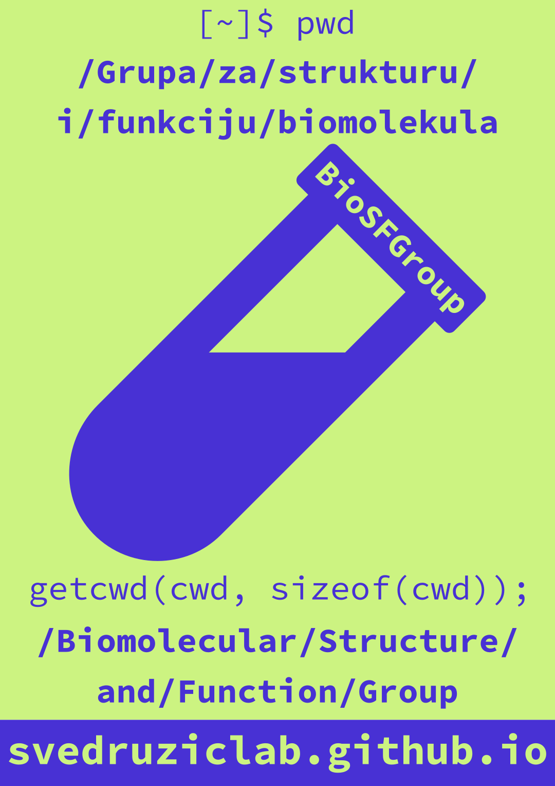

# Group

**Group Name:** **Bio**molecular **S**tructure and **F**unction **Group**

**Group Name in Croatian/hrvatski:** Grupa za strukturu i funkciju biomolekula

**Umbrella Institution:** [University of Rijeka](https://uniri.hr/) [Department of Biotechnology](https://www.biotech.uniri.hr/)

**Postal Address:** Radmile Matejčić 2, University Campus Trsat, HR-51000 Rijeka, Croatia ([on OpenStreetMap](https://www.openstreetmap.org/?mlat=45.32870&mlon=14.46690#map=19/45.32870/14.46690))

**Principal Investigator:** [Željko M. Svedružić, Ph.D.](principal-investigator.md), associate professor of biochemistry

## Students

If you are interested in joining the group, [contact us](contact.md).

## Alumni

### 2020/2021

- Manuel Martinović, M.Sc. in biotechnology, *former student research assistant*
- Viktor Morović, M.Sc. in biotechnology, *former student research assistant*
- Rajna Koren, M.Sc. in biotechnology, *former student research assistant*
- Morana Rijako, M.Sc. in biotechnology, *student research assistant*
- Ivona Vidović, M.Sc. in biotechnology, *former student research assistant*
- David Visentin, M.Sc. in biotechnology, *former student research assistant*
- Lucija Vrban, M.Sc. in biotechnology, *former student research assistant*

### 2019/2020

- Paulina Grizelj, M.Sc. in medicinal chemistry, *former student research assistant*
- Filip Petrić, M.Sc. in medicinal chemistry, *former student research assistant*
- Katarina Vrbnjak, M.Sc. in medicinal chemistry, *former student research assistant*; *Ph.D. student*, [VIB](https://vib.be/)/[KU Leuven](https://www.kuleuven.be/) [Center for Cancer Biology](https://ccb.sites.vib.be/) [Sablina Lab](https://vib.be/labs/sablina-lab)

### 2017/2018

- Lucija Ostojić, M.Sc. in medicinal chemistry, *former student research assistant*
- Janset Namlı, B.Sc. in genetic engineering, *visiting student from* [Biruni Üniversitesi](https://www.biruni.edu.tr/), *Istanbul, Turkey, summer 2018*

### 2016/2017

- Marta Hlača, M.Sc. student in vitro screening for novel drug-candidates for Alzheimer's disease, *former student research assistant*
- Andrea Klančić, M.Sc. student in vitro screening for novel drug-candidates for Alzheimer's disease, *former student research assistant*
- Stela Manestar, M.Sc. student in vitro screening for novel drug-candidates for Alzheimer's disease, *former student research assistant*
- Ena Subašić, M.Sc. student in vitro screening for novel drug-candidates for Alzheimer's disease, *former student research assistant*

### 2015/2016

- Ivica Odorčić, M.Sc. in medicinal chemistry, *former student research assistant*

### 2014/2015

- [Patrik Nikolić](https://nikoli.ch/), M.Sc. in medicinal chemistry; *owner*, [BioRX Partners](https://www.biorxpartners.com/); former *translational research scientist*, [RxTx Research](https://rxtxresearch.github.io/)

### Others

- [Miroslav Puškarić](https://www.hlrs.de/en/about-us/organization/people/person/puskaric/), M.Sc. in electrical engineering; *research assistant*, [High-Performance Computing Center Stuttgart (HLRS)](https://www.hlrs.de/)
- [Vedran Miletić](https://vedran.miletic.net/), Ph.D. in computer science; *assistant professor*, [Group for Applications and Services on Exascale Research Infrastructure (GASERI)](https://group.miletic.net/), [Faculty of Informatics and Digital Technologies](https://www.inf.uniri.hr/), [University of Rijeka](https://uniri.hr/); former *postdoctoral researcher*, [Molecular Biomechanics](https://www.h-its.org/research/mbm/), [Heidelberg Institute for Theoretical Studies](https://www.h-its.org/)
- [Tomislav Šubić](https://tsubic.info/), M.Sc. in information technology; *CEO*, [Yotta Advanced Computing](https://yac.hr/)

## Note to taxpayers

Much of the work of the BioSFGroup is paid with Croatian tax dollars, administered as research grants through the [University of Rijeka](https://uniri.hr/) and the [Croatian Science Foundation](https://hrzz.hr/). We are truly grateful for this support and are committed to making sure the public gets the best possible return on their investments in terms of scientific knowledge generated, new insights into disease mechanisms and treatments, new technologies developed and made freely available, training of the next generation of scientists, transactions with companies from whom we purchase research supplies and equipment, and gainful employment of project staff.

## Poster

[Download for printing (A2, portrait)](images/logo-poster.pdf)
