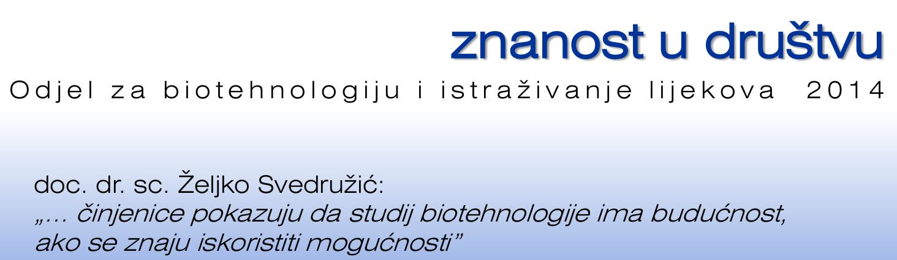
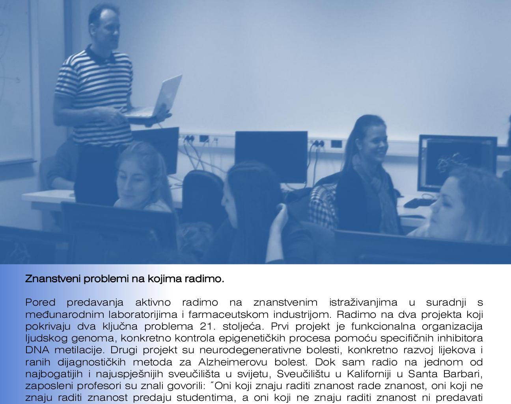
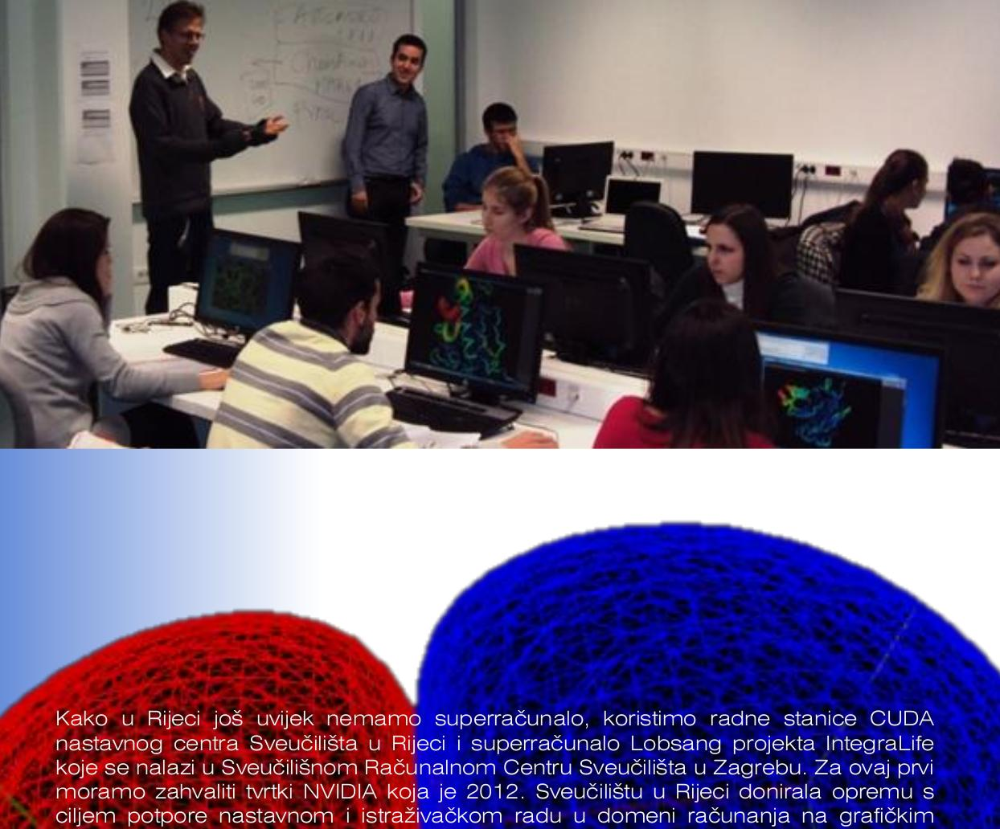

---
authors:
  - zsvedruzic
date: 2015-01-10
tags:
  - Media appearances
---

# BioSFGroup featured in student journal Biotech – znanost u društvu

BioSFGroup's [Prof. Dr. Željko Svedružić](../../principal-investigator.md), [Patrik Nikolić, and Vedran Miletić](../../group.md) were featured in in [University of Rijeka](https://www.uniri.hr/) [Department of Biotechnology](https://www.biotech.uniri.hr/) student journal Biotech – znanost u društvu [issue 3](../../files/biotech-znanost-u-drustvu-2014-12.pdf) ([also available on Issuu](https://issuu.com/biotech_ri/docs/__asopis_2014-novo)) from December 2014 (front page; pages 9–16: *interview: doc. dr. sc. Željko Svedružić*; page 17: *interview: Patrik Nikolić*; pages 18–19: *interview: Vedran Miletić*).

<!-- more -->

Discussing [the study programs at the Department of Biotechnology](https://www.biotech.uniri.hr/en/study-programmes.html), Dr. Svedružić was optimistic about their future in spite of the present challenges:

> Two years ago, economic experts in the German government pointed out that the development of biotechnology was the future of German industry. Finally, the pharmaceutical and related biochemical industries are today among the few industries in Croatia that are positively operating and competitive in the international market, despite a lagging administrative and political environment. Therefore, the facts show that studying biotechnology has a future if the opportunities are exploited.

[Read the full text in Biotech – znanost u društvu issue 3 (in Croatian).](../../files/biotech-znanost-u-drustvu-2014-12.pdf)
