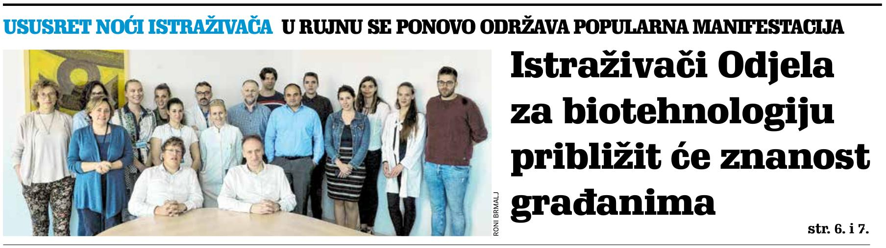
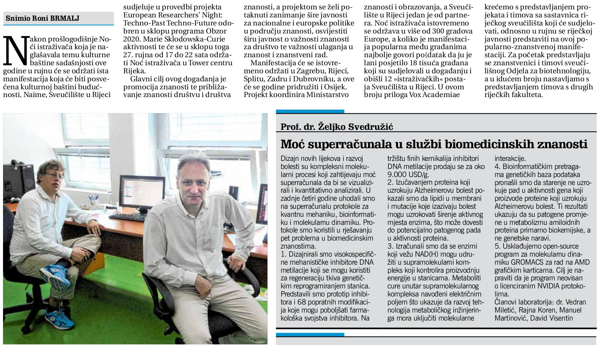

---
authors:
  - zsvedruzic
date: 2019-08-02
tags:
  - Media appearances
---

# BioSFGroup featured in Novi list's VOX academiae

[BioSFGroup's Prof. Dr. Željko Svedružić and Dr. Vedran Miletić](../../group.md) were featured in [Novi list's](https://www.novilist.hr/) University of Rijeka-themed monthly attachment [VOX academiae](https://uniri.hr/sveuciliste-i-drustvo/vox-academiae/) [issue 19](../../files/VOX-academiae-19-2019-08-02.pdf) (page 1; pages 6–7: *Istraživači Odjela za biotehnologiju približavaju znanosti građanima*).

<!-- more -->

Speaking about [the research being carried out](../../research.md) in [the group](../../group.md), Dr. Svedružić went straight to the point:

> The design of new drugs and the development of disease are complex molecular processes that require the power of supercomputers to be visualized and quantitatively analyzed. In the last four years, we have been in the field of supercomputing protocols for quantum mechanics, bioinformatics, and molecular dynamics. We used protocols to solve five problems in the biomedical sciences.

He then listed [the accomplishments and the results](../../principal-investigator.md) from [the present research projects](../../research.md).

[Read the full text in VOX academiae issue 19 (in Croatian).](../../files/VOX-academiae-19-2019-08-02.pdf)
