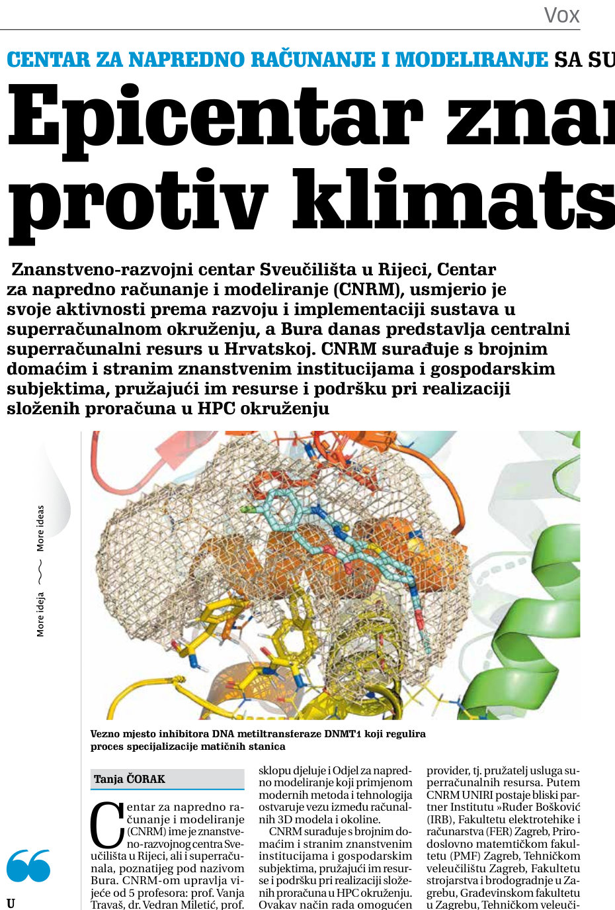

---
authors:
  - zsvedruzic
date: 2020-04-17
tags:
  - Media appearances
---

# BioSFGroup featured in Novi list's VOX academiae again

[BioSFGroup's Patrik Nikolić and Dr. Vedran Miletić](../../group.md)'s figure was featured in [Novi list's](https://www.novilist.hr/) University of Rijeka-themed monthly attachment [VOX academiae](https://uniri.hr/sveuciliste-i-drustvo/vox-academiae/) [issue 27](../../files/VOX-academiae-27-2020-04-17.pdf) (page 2 and page 3: *Epicentar znanstvenika u borbi protiv klimatskih promjena i virusa*).

<!-- more -->

On page 3, speaking about [the research being carried out in the group](../../research.md), the article writes:

> The design of new drugs is a complex research process that nowadays is largely performed on a supercomputer. Six years ago, an interdisciplinary collaboration was started within the Laboratory for the Structure and Function of Biomolecules between Dr. Željko Svedružić from the Department of Biotechnology and Dr. Vedran Miletić from the Department of Informatics. Active use to simulate the molecular dynamics and chemical reactions described by quantum physics and predict ligand binding. So far, highly specific DNA methylation inhibitors have been designed at Bura to be used in tissue regeneration by genetic reprogramming of cells. Such inhibitors are marketed for several thousand dollars per gram, which is two orders of magnitude more expensive than gold.
>
> Additionally, they are collaborating with Swedish academic Astrid Gräslund to study protein aggregation in the Alzheimer's disease process, for which simulations are also performed on the Bura, and recently, in collaboration with Dr. Anna Sablina of the Flemish Institute for Biotechnology in Belgium, they have begun high-throughput molecular screenings for molecules that can serve in the process of regulating RAS proteins, whose excessive activity influences cancer formation.

[Read the full text in VOX academiae issue 27 (in Croatian).](../../files/VOX-academiae-27-2020-04-17.pdf)
