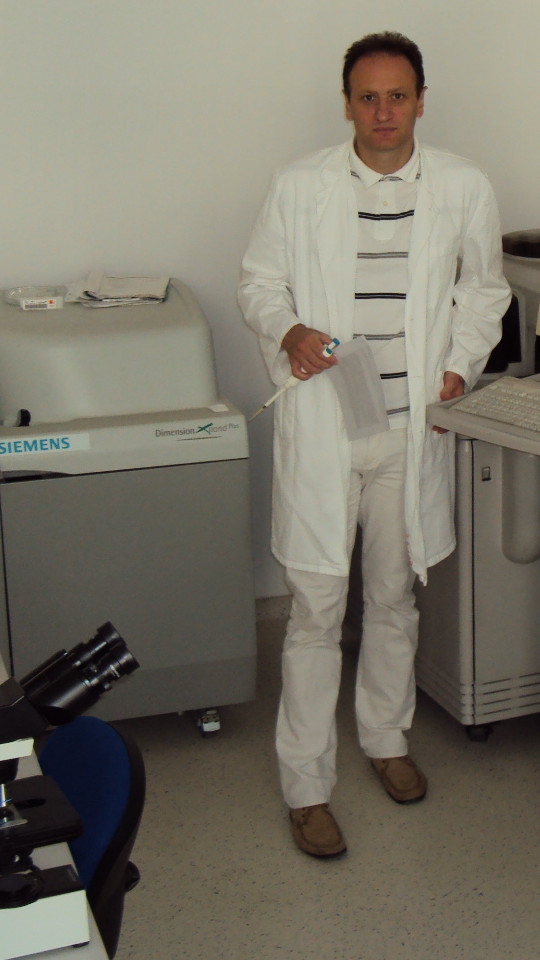

# Principal Investigator

**Principal Investigator Name:** Željko Svedružić

**International Spelling:** Zeljko M. Svedruzic

**Positions:** [Assistant Professor](https://portal.uniri.hr/Portfelj/2140) at [University of Rijeka](https://www.uniri.hr/) [Department of Biotechnology](https://www.biotech.uniri.hr/) and Adjunct Faculty at the [Faculty of Medicine](https://www.medri.uniri.hr/)

**E-mail:** zeljko.svedruzic-at-biotech.uniri.hr ([more, including social networks](contact.md))

**Postal Address:** Radmile Matejčić 2, University Campus Trsat, HR-51000 Rijeka, Croatia ([on OpenStreetMap](https://www.openstreetmap.org/?mlat=45.32870&mlon=14.46690#map=19/45.32870/14.46690))

**Office:** 8th floor, room number 823

**Phone Number:** +385-51-584-575

**Group:** [Biomolecular Structure and Function Group (BioSFGroup)](index.md)

## Research

1. Development of mechanism-based inhibitors of mammalian/human DNA methyltransferases with IC50 values below 50 nM. The most successful inhibitors can be used for control of the functional organization of the mammalian genome in research laboratories, biotechnology, and ultimately in clinics for the treatment of pathogenic mechanisms related to epigenetic processes (i.e. tissue regeneration, oncogenesis, psychiatric and neurological disorders, viral infections, immunological disorders).
1. Development of novel bivalent mechanism-based inhibitors of membrane-embedded protease γ-secretase. The most successful compounds can be used for treatment and early diagnosis of Alzheimer's disease, or for control of different physiological processes that depend on cell-to-cell communication. Paid consultant for the pharmaceutical industry, γ-secretase modulators, and assays.

## Career goals

Development and commercialization of inhibitors and modulators of human DNA methyltransferase Dnmt1 and membrane-embedded protease γ-secretase.

## Major accomplishments and perspective

### DNA methyltransferases

The enzymatic mechanism, regulation, and novel drug design strategies.

**Present research work:** Development of mechanism-based inhibitors of mammalian/human DNA methyltransferases.

### Membrane-embedded protease γ-secretase

The enzymatic mechanism, regulation, and novel drug-design and early diagnostic strategies for Alzheimer's disease.

**Present research work:** Development of novel bivalent mechanism-based inhibitors of membrane-embedded protease γ-secretase.

### Substrate channeling

Substrate channeling in transient protein-protein interactions. **Further research work in perspective.**

## Teaching

- On an ongoing basis: molecular modeling and numerical methods in biomedical sciences, i.e. structure and function of biomolecules, enzyme kinetics, and protein-ligand interactions. Courses presently taught:

    - **Chemoinformatics** (undergraduate level, since 2012/2013, [syllabus](teaching.md)) and
    - **Computational design of biologically active molecules** (master level, since 2013/2014, [syllabus](teaching.md)).

- Courses formerly taught:

    - **Physical organic and computational chemistry** (master level, 2015/2016).

- Mentoring individual students in research and thesis preparation.
- Invited lectures: molecular mechanisms in Alzheimer's disease or molecular mechanisms in epigenetics.

### Expertise

Molecular mechanisms in epigenetics and chromatin organization; molecular mechanisms in Alzheimer's disease; protein-protein and protein-ligand interactions; assay-development and drug-design based on enzyme structure-function principles; substrate channeling.

### Specialty

Enzymology: *in vitro*, *in vivo*, and *in silico* approaches for studies of structure and function of biomolecules.

### Training

Biochemistry, physical biochemistry (i.e. biophysics), medicinal chemistry, bioorganic chemistry, molecular genetics, biological membranes, medical biochemistry, cell biology.

## Work experience

- [University of Rijeka](https://www.uniri.hr/) [Department of Biotechnology](https://www.biotech.uniri.hr/) (2013 – present)

    - **Position:** Assistant Professor

- [University of Rijeka](https://www.uniri.hr/) [Faculty of Medicine](https://www.medri.uniri.hr/) (2010 – present)

    - **Position:** Adjunct Senior Research and Teaching Assistant

- [Psychiatry Hospital Rab](https://www.bolnicarab.hr/) (2010 – 2013)

    - **Position:** Supervisor of Laboratory for Medical Biochemistry

## Senior scientist appointments

- [Faculty of Medicine](https://med.kuleuven.be/) [KU Leuven Nederlands](https://www.kuleuven.be/) and [Eli Lilly and Company](https://www.lilly.com/) Neurodegenerative Diseases Drug Hunting Team (2007 – 2010)

    - **Project:** Molecular pathophysiology of Alzheimer's disease and inhibitors of intramembrane protease γ-secretase.
    - **Project Leaders:** [Professor Bart de Strooper](https://cbd.vib.be/labs/de-strooper-lab) (KU Leuven) and [Eric Karran, Ph.D.](http://www.dartneuroscience.com/ScientificAdvisoryBoard-Details.php?uid=ekarran) (Eli Lilly)

- [Washington State University](https://wsu.edu/) [School of Molecular Biosciences](https://www.smb.wsu.edu/) (2003 – 2006)

    - **Project:** DNA damage-induced changes in DNA flexibility and DNA-nucleosome interaction. DNA repair in nuclear extracts.
    - **Project Leader:** [Regents Professor Michael J. Smerdon](https://public.wsu.edu/~smerdon/)

## Postdoctoral research

- [University of California Santa Barbara](https://www.ucsb.edu/) [Department of Chemistry](https://www.chem.ucsb.edu/) and Epigenx Pharmaceuticals, Inc. (1998 – 2000; 2002)

    - **Project:** Enzymology and inhibitors of mammalian and bacterial cytosine DNA methyltransferases.
    - **Project Leader:** [Professor Norbert O. Reich](https://reich.chem.ucsb.edu/norbert-reich)

- [Duke University Medical Center](https://medicine.duke.edu/) [Department of Biochemistry](https://www.biochem.duke.edu/) (2001)

    - **Project:** Enzymology of protein phosphatase CDC25B with Cdk2/CycA protein complex as the substrate (Cdk2 = cycline dependent kinase 2; CycA = cyclin A).
    - **Project Leader:** [Asisstant Professor Johannes Rudolph](https://profiles.ucdenver.edu/display/225937)

## Education

- [Oklahoma State University](https://go.okstate.edu/) [Department of Biochemistry and Molecular Biology](https://agriculture.okstate.edu/departments-programs/biochemistry/) (1993 – 1998)

    - **Ph.D. Thesis Title:** Substrate Channeling between NAD(H) Dehydrogenases: Enzyme Kinetics, Protein-Protein Interaction, and Molecular Modeling Studies.
    - **Mentor:** Professor H. Olin Spivey (deceased)

- [Max Planck Institute of Biochemistry](https://www.biochem.mpg.de/) (1992 – 1993)

    - **Master Thesis Title:** Purification of p17 protein; a component of Actin-Myosin complex from Dictyostelium discoideum.
    - **Mentor:** [Emeritus Günther Gerisch](https://www.biochem.mpg.de/en/eg/gerisch)

- [University of Zagreb](http://www.unizg.hr/) [Faculty of Science](https://www.pmf.unizg.hr/), [Department of Biology](https://www.pmf.unizg.hr/biol) (1988 – 1992)

    - Undergraduate studies in biochemistry and molecular biology.

## Publications

### Journal papers

1. Gielnik, M., Taube, M., Zhukova, L., Zhukov, I., Wärmländer, S. K. T. S., Svedružić, Ž., Kwiatek, W. M., Gräslund, A., and Kozak, M. [Zn(II) binding causes interdomain changes in the structure and flexibility of the human prion protein.](https://www.nature.com/articles/s41598-021-00495-0) *Nature Scientific Reports* **11**, 21703 (2021). [PDF](https://www.nature.com/articles/s41598-021-00495-0.pdf)
1. Chaudhary, H., Iashchishyn, I. A., Romanova, N. V., Rambaran, M. A., Musteikyte, G., Smirnovas, V., Holmboe, M., Ohlin, C. A., Svedružić, Ž. M., and Morozova-Roche, L. A.. [Polyoxometalates as Effective Nano-inhibitors of Amyloid Aggregation of Pro-inflammatory S100A9 Protein Involved in Neurodegenerative Diseases.](https://pubs.acs.org/doi/full/10.1021/acsami.1c04163) *ACS Applied Materials & Interfaces* **13**(23), 26721-26734 (2021). [PDF](https://pubs.acs.org/doi/pdf/10.1021/acsami.1c04163)
1. Leri M., Chaudhary H., Iashchishyn, I. A., Pansieri, J., Svedružić, Ž. M., Alcalde, S. G., Musteikyte, G., Smirnovas, V., Stefani, M., Bucciantini, M., and Morozova-Roche, L. A., [Natural Compound from Olive Oil Inhibits S100A9 Amyloid Formation and Cytotoxicity: Implications for Preventing Alzheimer's Disease.](https://pubs.acs.org/doi/full/10.1021/acschemneuro.0c00828) *ACS Chemical Neuroscience* **12**(11), 1905-1918 (2021). [PDF](https://pubs.acs.org/doi/pdf/10.1021/acschemneuro.0c00828)
1. Svedružić, Ž. M., Vrbnjak, K., Martinović, M., and Miletić, V. [Structural Analysis of the Simultaneous Activation and Inhibition of γ-Secretase Activity in the Development of Drugs for Alzheimer's Disease.](https://www.mdpi.com/1999-4923/13/4/514) *Pharmaceutics* **13**(4), 514, April 8th (2021). [PDF](https://www.mdpi.com/1999-4923/13/4/514/pdf)
1. Svedružić, Ž. M., Odorčić, I., Chang, C. H., and Svedružić, D. [Substrate Channeling via a Transient Protein-Protein Complex: The case of D-Glyceraldehyde-3-Phosphate Dehydrogenase and L-Lactate Dehydrogenase.](https://www.nature.com/articles/s41598-020-67079-2) *Sci. Rep.* **10**, 10404, June 26th (2020). [PDF](https://www.nature.com/articles/s41598-020-67079-2.pdf), [PubMed](https://pubmed.ncbi.nlm.nih.gov/32591631/)
1. Pansieri, J., Ostojić, L., Iashchishyn, I. A., Magzoub, M., Wallin, C., Wärmländer, S. K. T. S., Gräslund, A., Nguyen Ngoc, M., Smirnovas, V., Svedružić, Ž., and Morozova-Roche, L. A., [Pro-Inflammatory S100A9 Protein Aggregation Promoted by NCAM1 Peptide Constructs.](https://pubs.acs.org/doi/full/10.1021/acschembio.9b00394) *ACS Chem. Biol.* **14**, 1410–1417 (2019). [PDF](https://pubs.acs.org/doi/pdf/10.1021/acschembio.9b00394), [PubMed](https://www.ncbi.nlm.nih.gov/pubmed/31194501)
1. Miletić, V., Odorčić, I., Nikolić, P., and Svedružić, Ž. M. [In silico design of the first DNA-independent mechanism-based inhibitor of mammalian DNA methyltransferase Dnmt1.](https://journals.plos.org/plosone/article?id=10.1371/journal.pone.0174410) *PLoS One* **12**(4), April 11th (2017). [PDF](https://journals.plos.org/plosone/article/file?id=10.1371/journal.pone.0174410&type=printable), [PubMed](https://www.ncbi.nlm.nih.gov/pubmed/28399172)
1. Svedružić, Ž. M., Popović, K., and Šendula-Jengić, V. [Decrease in catalytic capacity of γ-secretase can facilitate pathogenesis in sporadic and Familial Alzheimer's disease.](https://www.sciencedirect.com/science/article/pii/S1044743115000901) *Molecular and Cellular Neuroscience* **67**, July 31st (2015). [PDF](files/Svedruzic-DCCSCFPSFAD-2015.pdf)
1. Svedružić, Ž. M., Popović, K., and Šendula-Jengić, V. [Modulators of γ-secretase activity can facilitate the toxic side-effects and pathogenesis of Alzheimer's disease.](https://journals.plos.org/plosone/article?id=10.1371/journal.pone.0050759) *PLoS One* **8**(1), January 7th (2013). [PubMed](https://www.ncbi.nlm.nih.gov/pubmed/23308095)
1. Svedružić, Ž. M. Popović, K., Smoljan, I., and Šendula-Jengić, V. [Modulation of γ-secretase activity by multiple enzyme-substrate interactions: Implications in pathogenesis of Alzheimer's disease.](https://journals.plos.org/plosone/article?id=10.1371/journal.pone.0032293) *PLoS One* **7**(3), March 30th (2012). [PubMed](https://www.ncbi.nlm.nih.gov/pubmed/22479317)
1. Svedružić, Ž. M. [Mammalian Cytosine DNA methyltransferase Dnmt1: Enzymatic Mechanism, Novel Mechanism-Based Inhibitors, and RNA-directed DNA methylation.](https://www.eurekaselect.com/66158/article) *Current Medicinal Chemistry* **15**(1), 92–106 (2008). [PubMed](https://www.ncbi.nlm.nih.gov/pubmed/18220765), [PDF](files/Svedruzic-MCDMD-2008.pdf)
1. Svedružić, Ž. M. and Spivey, H. O. [Interaction between Mammalian Glyceraldehyde-3-phosphate Dehydrogenase and L-Lactate Dehydrogenase from Heart and Muscle.](https://onlinelibrary.wiley.com/doi/abs/10.1002/prot.20862) *Proteins, Structure, Function, and Bioinformatics* **63**(3), 501–511 (2006). [PubMed](https://www.ncbi.nlm.nih.gov/pubmed/16444750), [PDF](files/Svedruzic-IMGDLDHM-2006.pdf)
1. Svedružić, Ž. M., Wang, C., Kosmoski, J. V., and Smerdon, M. J. [Accommodation and Repair of a UV Photoproduct in DNA at Different Rotational Settings on the Nucleosome Surface.](https://www.jbc.org/article/S0021-9258(19)48134-9/fulltext) *Journal of Biological Chemistry* **280**(48), 40051–40057 (2005). [PubMed](https://www.ncbi.nlm.nih.gov/pubmed/16210312)
1. Svedružić, Ž. M. and Reich, N. O. [The Mechanism of Allosteric Regulation of Dnmt1's Processivity.](https://pubs.acs.org/doi/abs/10.1021/bi050988f) *Biochemistry* **44**(45), 14972–14988 (2005). [PubMed](https://www.ncbi.nlm.nih.gov/pubmed/16274244), [PDF](files/Svedruzic-MARDP-2005.pdf)
1. Svedružić, Ž. M. and Reich, N. O. [DNA Cytosine C5 Methyltransferase Dnmt1: Catalysis Dependent Release of Allosteric Inhibition.](https://pubs.acs.org/doi/abs/10.1021/bi050295z) *Biochemistry* **44**(27), 9472–9485 (2005).
1. Svedružić, Ž. M. and Reich, N. O. [The Mechanism of Target Base Attack in DNA Cytosine C5 Methylation.](https://pubs.acs.org/doi/abs/10.1021/bi0496743) *Biochemistry* **43**(36), 11460–11473 (2004).
1. Lehoux E. A., Svedružić, Ž., and Spivey, H. O. [Determination of Specific Radioactivity of [14C] Lactate by Enzymatic Decarboxylation and CO2 Collection.](https://www.sciencedirect.com/science/article/pii/S0003269797923538) *Analytical Biochemistry* **253**(2), 190–195 (1997).

### Brief reports

1. Rokić, F., Trgovec-Greif, L., Sučić, N., Čemeljić, N., Cekinović Grbeša, Đ., Svedružić, Ž., Rukavina, T., Vugrek, T., and Jurak, I. [Diverse SARS-CoV-2 variants preceded the initial COVID-19 outbreak in Croatia.](https://link.springer.com/article/10.1007/s00705-021-05029-7) *Arch. Virol.*, March 24th (2021). [PDF](https://link.springer.com/content/pdf/10.1007/s00705-021-05029-7.pdf), [PubMed](https://pubmed.ncbi.nlm.nih.gov/33761008/)

### Conference abstracts

1. Nikolić P., Miletić V., and Svedružić, Ž. M. **DNA Methyltransferase Dnmt1: Regulation of Substrate Selectivity.** In *6th OEGMBT Annual Meeting 2014 Abstract Book*, edited by Alexandra Khassidov, Walter Glaser, and Christoph Klimek, 129. Vienna, Austria: Austrian Association of Molecular Life Sciences; Biotechnology; Servicebetrieb ÖH-Uni Graz GmbH. (2014).
1. Svedružić, Ž. M. and Reich, N. O. **Enzymatic properties of mouse cytosine DNA methyltransferase DNMT1.** Abstracts of Papers of the American Chemical Society 223:C75. (2002).

### Book chapters

1. Nikolić, P., Miletić, V., Odorčić, I., and Svedružić, Ž. M. (2016). [In Silico Optimization of the First DNA-Independent Mechanism-Based Inhibitor of Mammalian DNA Methyltransferase DNMT1](https://www.sciencedirect.com/science/article/pii/B9780128028087000058). In: [Epi-Informatics](https://www.sciencedirect.com/science/book/9780128028087), (Boston: Academic Press), pp. 113–153. [PDF](files/Svedruzic-IOFDIMBIMDMD-2016.pdf)
1. Svedružić, Ž. M. [Mammalian DNA methyltransferase Dnmt1: Structure and Function.](https://www.sciencedirect.com/science/article/pii/B9780123876850000068) In: Modification of Mammalian DNA: Mechanism, Management, Missions, and Medical Implications. *Progress in Molecular Biology and Translational Science* **101**, 221–254 (Elsevier, 2011). [PubMed](https://www.ncbi.nlm.nih.gov/pubmed/21507353), [PDF](files/Svedruzic-Ch6-DNMT1SF-2011.pdf)

### In preparation

1. Svedružić, Ž. M., Nikolić, P., Miletić, V., and Odorčić, I. **Substrate-lock mechanism controls de novo methylation by mammalian DNA methyltransferase Dnmt1.**
1. Svedružić, Ž. M., Popović, K., and Šendula-Jengić, V. **The basic enzymology of modulation of γ-secretase activity: identification of the key pharmacophoric groups.**
1. Svedružić, Ž. M. **A flexible loop and two charged amino acids regulate formation and break-up of transient catalytic complex between protein phosphatase CDC25B and Cdk2/Cycline-A heterodimer.**

### Publication databases

- [CROSBI](https://www.bib.irb.hr/pregled/profil/27449)
- [Google Scholar](https://scholar.google.com/citations?user=fdEi0GkAAAAJ)
- [ORCID](https://orcid.org/0000-0002-0736-6182)
- [PubFacts](https://www.pubfacts.com/author/Zeljko+M+Svedruzic)
- [Publons](https://publons.com/researcher/1862348/zeljko-m-svedruzic/)
- [ResearcherID](https://www.researcherid.com/rid/R-3281-2018)
- [Scopus](https://www.scopus.com/authid/detail.uri?authorId=9846095100)
- [Web of Science](https://www.webofscience.com/wos/author/record/2884118)

## Miscellaneous

### References

- [Professor Bart de Strooper](https://cbd.vib.be/labs/de-strooper-lab), [KU Leuven](https://www.kuleuven.be/)
- [Regents Professor Michael J. Smerdon](https://public.wsu.edu/~smerdon/), [Washington State University](https://wsu.edu/)
- [Professor Norbert O. Reich](https://reich.chem.ucsb.edu/norbert-reich), [University of California Santa Barbara](https://www.ucsb.edu/)
- [Ludmilla Morozova-Roche](https://www.umu.se/en/staff/ludmilla-morozova-roche/), [Umeå University](https://www.umu.se/)

### Ad hoc reviewer

- [DNA Repair](https://www.journals.elsevier.com/dna-repair/), [Elsevier](https://www.elsevier.com/)
- [Epigenetics](https://www.tandfonline.com/loi/kepi20), [Taylor & Francis Group](https://www.tandfonline.com/) (formerly Landes Bioscience)
- [Biochemical Journal](https://portlandpress.com/biochemj), [Biochemical Society](https://www.biochemistry.org/)
- [Bioorganic & Medicinal Chemistry Letters](https://www.journals.elsevier.com/bioorganic-and-medicinal-chemistry-letters/), [Elsevier](https://www.elsevier.com/)
- [Journal of Neuroscience](https://www.jneurosci.org/), [Society for Neuroscience](https://www.sfn.org/)
- [Biochimie](https://www.journals.elsevier.com/biochimie/), [Elsevier](https://www.elsevier.com/)
- [Current Medicinal Chemistry](https://benthamscience.com/journal/index.php?journalID=cmc), [Bentham Science](https://benthamscience.com/)
- [WebmedCentral](https://www.webmedcentral.com/) [Biochemistry](https://www.webmedcentral.com/speciality/Biochemistry)

### Invited lectures

1. [248th ACS National Meeting and Exposition](https://cen.acs.org/articles/92/i28/248th-ACS-National-Meeting.html). ChemEpInformatics: In the Pursuit of Epidrugs Using Chemoinformatics and Computational Approaches, August 10–14, 2014, San Francisco, CA, USA. [DNA methyltransferase Dnmt1: Regulation and novel drug-design strategies.](https://www.acscinf.org/bulletin)
1. EuroSciCon: Alzheimer's Drug Discovery and Development, June 25, 2014, London, UK. [Modulators of γ-secretase activity can facilitate the toxic side-effects and pathogenesis of Alzheimer's disease.](https://www.lifescienceevents.com/wp-content/uploads/Alzheimer23rd-25thJuneABSTRACTS2014.pdf)
1. [Ruder Bošković Institute](https://www.irb.hr/), May 23, 2013, Zagreb, Croatia. [Alzheimerova bolest iz molekularne perspektive: patogeneza, rana dijagnostika i razvoj novih lijekova.](https://www.irb.hr/Kalendar/Arhiva-tjednog-kalendara/Kolokvij-Zavoda-za-molekularnu-medicinu27)
1. 4th Croatian Congress on Side Effects of Psychopharmacs, March 29–31 2012, Osijek, Croatia. [Side effects of antipsychotics: how to avoid them and how can they be useful.](https://www.penta-pco.com/2seminarosijek/en/program.html)

### Public talks and popular lectures

1. [European Researchers' Night 2019](https://youtu.be/oPZPhnVnECs) in Rijeka, Tower Center, September 27, 2019, Rijeka, Croatia.
1. [European Researchers' Night 2018](https://youtu.be/52U9xF-fIzI) [in Rijeka](https://youtu.be/3KczFTftjnw), [Tower Center](https://www.tower-center-rijeka.hr/magazin/sto-vas-sve-ceka-na-noci-istrazivaca/), September 28, 2018, Rijeka, Croatia. [Mikroskop vs. superračunala u farmaciji (superračunala kao mikroskopi 21. stoljeća).](https://youtu.be/_65gSYQ57bs)
1. [Društvo za promociju znanosti i kritičkog mišljenja](http://www.pzkm.org/), June 13, 2014, Rijeka, Croatia. [Epigenetika i utjecaj epigenetike na ljudsko ponašanje, zdravlje i budućnost medicine: prvi dio (predavanje)](https://youtu.be/7lbLe0IMsEk) i [drugi dio (Q&A)](https://youtu.be/DmHVkd5Avw0).
1. [European Researchers' Night 2013 in Rijeka](https://youtu.be/JYiQ-cEw0b8?t=2m7s), September 27, 2013, Rijeka, Croatia.
1. Psychiatric Hospital Rab, [Internacionalna škola iz psihijatrije i kognitivne neuroznanosti](https://www.bolnicarab.hr/hr/zbornik_radova_2_internacionalna_skola_iz_psihijatrije_i_kognitivne_neuroznanosti_psihijatrijsko_psiholoski_aspekti_multiple_skleroze/210/57), October 4–5, 2012, Rab, Croatia. [Strah od znanosti i tehnologije u doba globalne ekonomske krize.](https://youtu.be/5N1a4b_AyH0)
1. Psychiatric Hospital Rab, Tjedan mozga, March 4–5, 2012, Rab, Croatia. [Geni, ljudsko ponašanje i kako praviti nove lijekove](https://www.bolnicarab.hr/hr/tjedan_mozga_u_psihijatrijskoj_bolnici_rab/199/51)
1. Psychiatric Hospital Rab, Tjedan mozga, March 11–20, 2011, Rab, Croatia. [Morbus Alzheimer - može li se spriječiti i kako liječiti](https://www.bolnicarab.hr/hr/psihijatrijska_bolnica_rab_u_obiljezavanju_tjedna_mozga/141/51)

### Miscellaneous experience

1. Conferences: almost 20 years of active participation in professional meetings and conferences.
1. Teaching: almost 20 years of active direct and indirect mentoring of junior colleagues in research laboratories.

### Personal

My sister [Draženka](https://www.nrel.gov/research/staff/drazenka-svedruzic.html) works as a Research Scientist at [NREL](https://www.nrel.gov/) [Bioenergy](https://www.nrel.gov/bioenergy/).

My name is pronounced as *Zhelko Svedruzhich*, with *zh* pronounced as letters *asu* in words like: *treasure*, *pleasure*, *measure*.

My name appears on papers in different forms. Some of them are **Svedruzic, ZM**, **Svedruzic, Z. M.**, **Svedružić, ŽM**, and **Svedružić, Ž. M.** Name will appear with or without Croatian accents depending on the publication.
