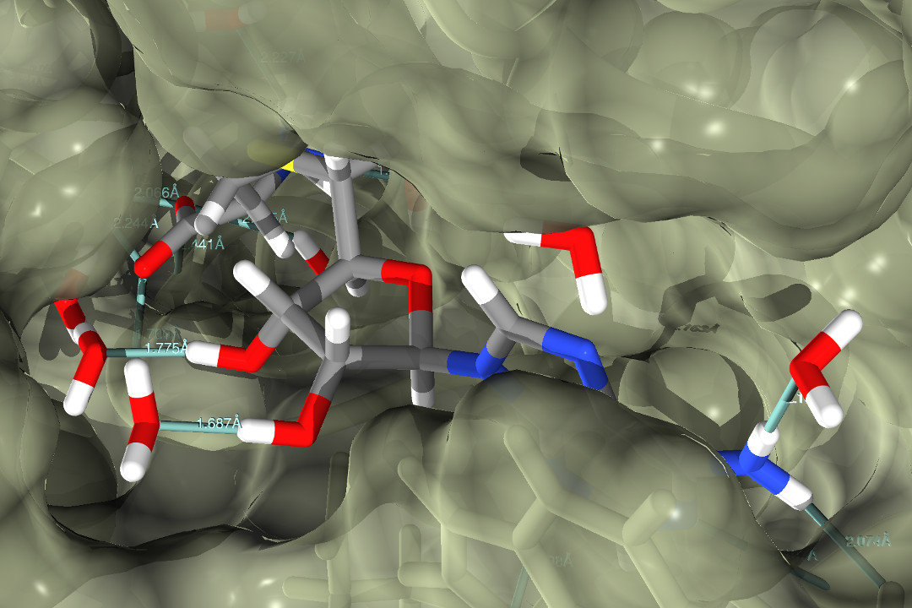
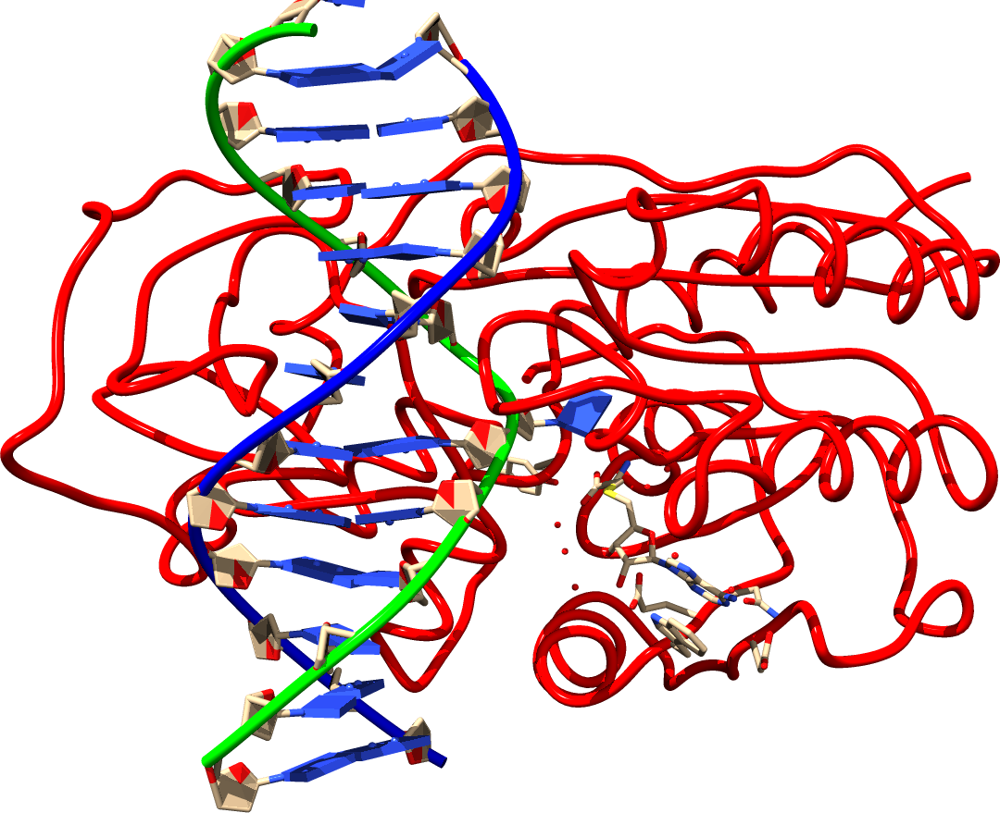

# Research

The research work in **Bio**molecular **S**tructure and **F**unction **Group** is centered on the two most prominent problems in biomolecular sciences in the 21st century. In the first project, we are studying the functional organization of the human genome, more specifically activation and inhibition of DNA methylation in human cells. In the second project, we are working on neurodegenerative diseases, more specifically on the development of novel drug candidates and early diagnostic methods for Alzheimer's disease. (See [the Projects section below](#projects) for details.) Different combinations of wet-laboratory experiments and computational studies are used to analyze the pathogenic processes at the molecular level. We have active collaboration with the different academic laboratories and the pharmaceutical industry.

## Computation and wet laboratory

We are using classical MD, QM, and QM/MM molecular modeling and simulation software, some of which are GROMACS, AutoDock Vina, RxDock, CP2K, GAMESS (US), VMD, PyMOL, UCSF Chimera, Avogadro, ChemAxon Marvin Suite, AmberTools via acpype, and Open Babel. Supplementary numerical analysis and graph plotting software packages such as LibreOffice Calc, R and Bio3D, SciDAVis, and gnuplot are used for analysis and visualization of simulation output. Combining the open-source and proprietary computational chemistry software available software, we developed mostly open-source drug design pipelines to empower our research and increase the efficiency of wet-lab experiments. More info is available on [the dedicated Software page](software.md).

For computations, we rely on the equipment of [Center for Advanced Computing and Modelling](https://crnm.uniri.hr/bura/) at the [University of Rijeka](https://uniri.hr/). For wet-lab experiments, we use [equipment available at the Department of Biotechnology](https://www.biotech.uniri.hr/en/equipment.html) at the University of Rijeka.

## Industry partnership

We are developing novel drugs for Alzheimer's disease in collaboration with [Jiva Pharmaceuticals](https://www.jivapharma.com/), a private pharmaceutical company.

## Projects

### The development of novel bivalent mechanism-based inhibitors of membrane-embedded protease gamma secretase

Alzheimer's disease has been called the most expensive plague of the 21 century. Alzheimer's disease is slowly progressing, a fatal neurodegenerative disorder. Recently Alzheimer's disease has surpassed malignant diseases as the biggest financial burden for health care providers in developed countries. This problem is likely to increase with an increase in life expectancy in the future. Developed countries are seriously investing in related research, and Alzheimer's disease is one of the most lucrative pharmaceutical markets. For research scientists interest in Alzheimer's disease goes beyond the search for a cure, since this disease is one of the best-known examples of numerous degenerative disorders caused by protein aggregation and aging.

**State of the art.** Most of the studies of Alzheimer's disease have explored different shreds of evidence that the pathogenesis can be driven by changes in the metabolism of Amyloid precursor protein (APP), in particular its membrane-bound C terminal fragment (β-CTF-APP), and the related insoluble Aβ peptides. First, APP protein is cleaved by a membrane-bound protease β-secretase to produce β-CTF-APP fragment. Second, the β-CTF-APP is cleaved by a membrane-embedded protease γ-secretase to produce different amyloid-β peptides (Aβ peptides). Soluble Aβ 1-40 peptides can be found in healthy brain tissue, while Aβ 1-42 peptides can be found in protein aggregates in brain tissue of diseased patients. Thus, different therapeutic approaches have targeted β-secretase and γ-secretase in an attempt to increase Aβ 1-40 production and decrease Aβ 1-42 production. Impressive efforts in basic and pharmaceutical research have led to more than a hundred different therapeutic approaches. Many of them reached clinical trials, including phase III. Sadly, all of those trials have led to disappointments and in some cases surprisingly daunting results.

A large number of unsettling failures have deeply shaken the confidence of the pharmaceutical industry in its current drug development strategies. Interestingly, very few people have noticed that thus far the new drug candidates have been developed with very little knowledge about the underlining molecular mechanism. Precisely, at the time of writing of this proposal, a Pubmed search for “Alzheimer's" disease gives more than 102234 entries! Only about 61% of all publications on Alzheimer's disease (60600 entries), can be retrieved using a search that is focused on the “Alzheimer's AND Aβ OR amyloid". Interestingly, only about 6% of all of the Alzheimer's disease publications, or about 5876 entries, could be retrieved with a search focused on “Alzheimer AND gamma-secretase OR beta-secretase". These numbers indicate that a wide range of possible pathogenic processes have been explored, and the main problem could be a lack of insights into the key molecular events. Without adequate insights into the catalytic mechanism of γ-secretase, the development of the new drug candidates and the early diagnostic methods will remain expensive guesswork with a high risk of failure.

**Our work.** We are working on those rare and acutely needed studies of the molecular mechanism using some of the best-known drug candidates. Specifically, we analyze the biphasic activation inhibition dose-response curves, one of the best examples of the unique molecular mechanism of γ-secretase. The great majority of drug candidates that target γ-secretase show very unusual biphasic activation-inhibition dose-response curves at physiological substrate concentration. The biphasic profiles can be observed with cells, experimental animals, and in clinical trials with patients. The biphasic profiles can be observed only at subsaturating physiological substrate concentrations. Thus, they are often unnoticed in industrial high-throughput screening. That is a big oversight since it is hard to expect that an effective drug candidate can be developed from a compound that can both activate and inhibit the target enzyme for unknown reasons. The mechanism behind this activation-inhibition phenomenon has to be resolved if we want to continue the development of new drug candidates that target gamma-secretase. Moreover, carefully designed biphasic inhibitors can be used to selectively modulate the production of toxic Aβ 1-42 peptides relative to nontoxic Aβ 1-40 peptides (i.e. modulators of gamma-secretase activity as opposed to gamma-secretase inhibitors).

### The development of mechanism-based inhibitors of human DNA methyltransferase Dnmt1

DNA methylation is a part of epigenetic processes that control how our genes respond to our environment. For example, DNA methylation can regulate how learning and training affect our brain and body, as well as many of the autonomous adaptive physiological processes such as skin keratinization or adaptation to different types of nutrition. DNA methylation can also control different pathogenic events, such as psychiatric disorders, allergies, viral infections, and the development of cancer.

On the technology side, controlled manipulation of DNA methylation in cells can be used for tissue regeneration in clinical laboratories, or in research laboratories for analysis of the functional organization of the human genome. For example, DNA methylation regulates the transition from embryonic stem cells to differentiated cells. Specific inhibitors of DNA methylation can be used for reversing those processes in the engineering of damaged tissues ([The Nobel Prize in Physiology or Medicine 2012](https://www.nobelprize.org/prizes/medicine/2012/summary/)).

**State of the art.** Currently inhibitors of DNA methylation are selling on the fine chemicals market for research and clinical laboratories, and on pharmaceutical markets as a FAD-approved treatment for myelodysplastic syndrome. There are five major inhibitors on the market. The most popular inhibitor Dacogen® has an annual market of about 251 million USD. On the fine chemical markets inhibitors of DNA methylation are selling for about 450 USD per 50 mg, which is about 250 times more expensive than gold with the current gold prices. It is important to notice that all of the inhibitors that are currently on the market are very toxic and have limited effectiveness. Thus the corresponding markets are small and unstable.

DNA methylation inhibitors that are currently on the market are based on old technology (i.e. 1987) with design limitations that could not be circumvented.

**Our work.** We are developing mechanism-based warhead inhibitors of mammalian/human DNA methyltransferases with IC50 values below 50 nM. Our inhibitors are based on the newest technologies that are the result of extensive experimental work in the last 15 years. All our inhibitors have been optimized and pretested using computational simulations and experimental results. Our inhibitors are expected to have much lower toxicity due to the specific mechanism of action that has been engineered to the atomic details. Lower toxicity means more applications and bigger markets.

In short term, we want to deliver our inhibitors of DNA methylation to research and clinical laboratories. Research laboratories can use the inhibitors for the analysis of the functional properties of the human genome. Studies of the functional organization of the human genome are the best-funded studies in the last 15 years. Clinical laboratories can use the inhibitors for developing processes of tissue engineering and tissue regeneration. Our inhibitors can reach the fine chemical markets very quickly since such markets do not require long testing processes like the development of novel drug candidates. The inhibitors that show success in the fine chemical markets can be further developed into novel drug candidates.

The most successful inhibitors can be used for control of the functional organization of the mammalian genome in research laboratories, biomedical technology, and ultimately in clinics for the treatment of different diseases that depend on epigenetic processes. Some examples are tissue regeneration, oncogenesis, psychiatric and neurological disorders, viral infections, immunological disorders.

### Supramolecular organization of NAD(H)-binding enzymes

Description coming soon.

**Our work.** We have calculated that enzymes that bind NAD(H) can coalesce into a supramolecular complex that controls energy production in cells. Metabolites leaks within the supramolecular complex driven by an electric field indicating that the development of metabolic engineering technologies must involve molecular interactions.
